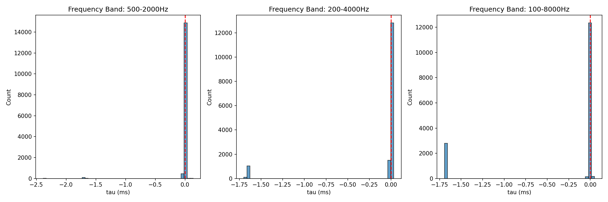
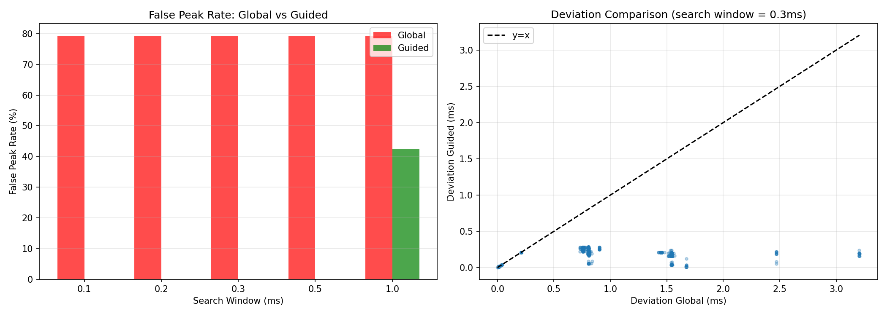
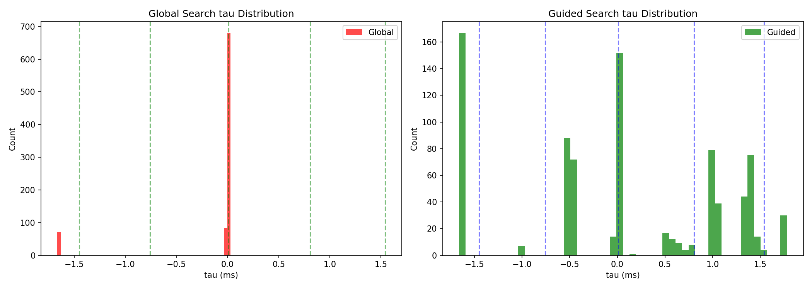
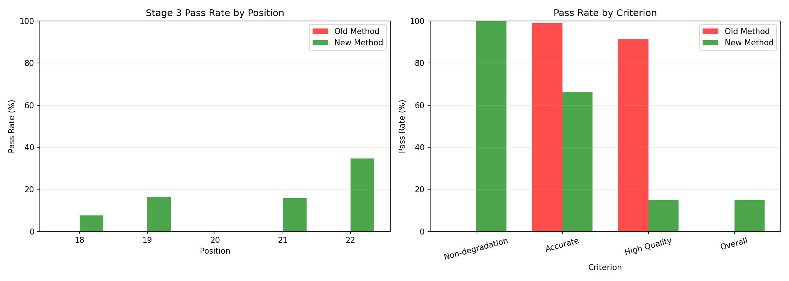
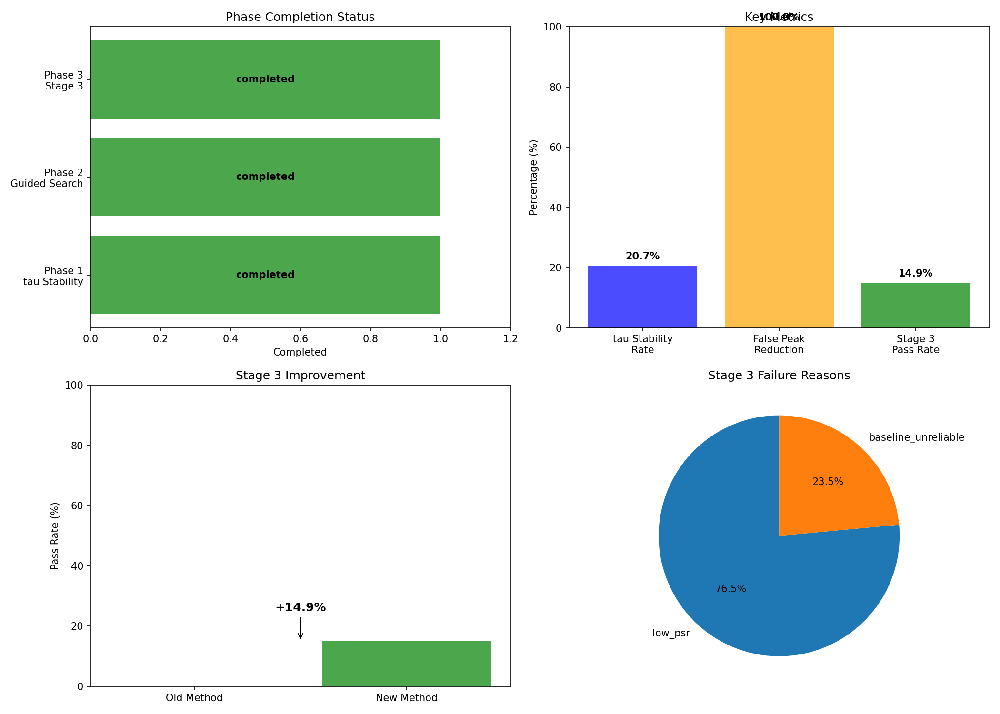
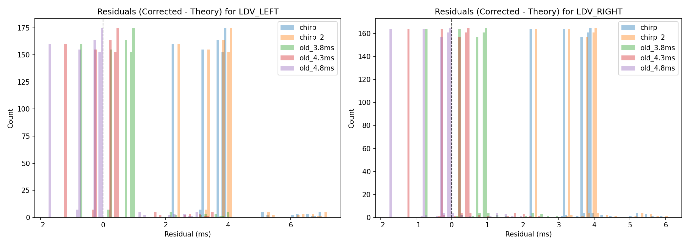
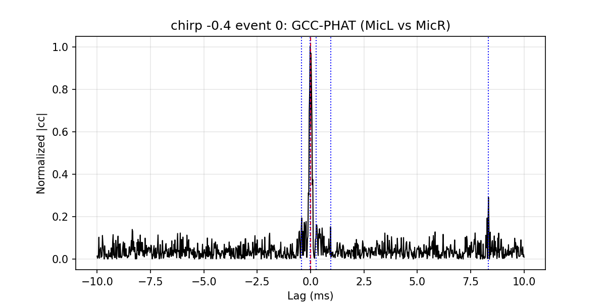
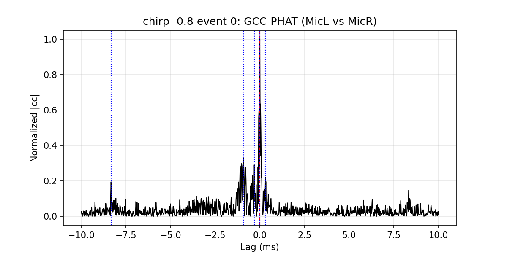
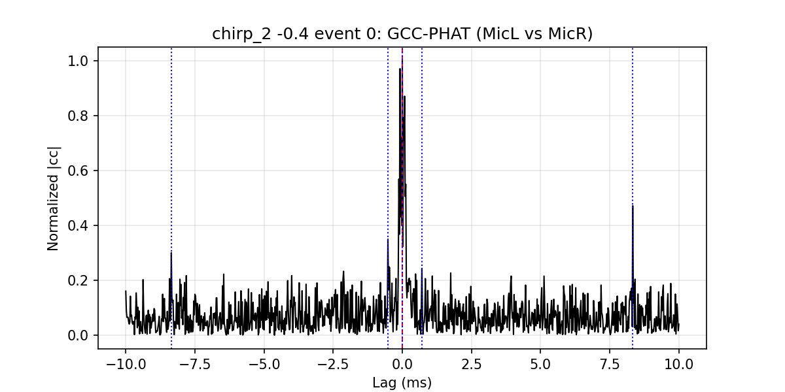
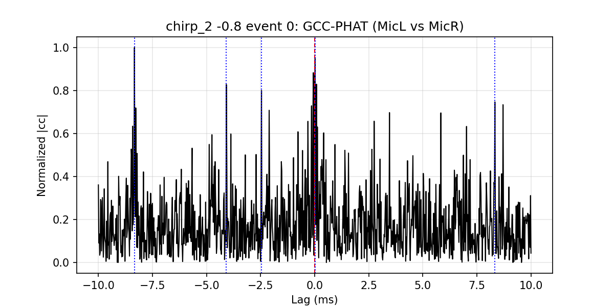

# Chirp Reference Validation Report (Detailed, English)

Run ID: `20260207_173915`
Generated: `2026-02-07 21:56:22`

## 1. Executive Summary
- Step 0 succeeded; 3/5 positions have reliable chirp references, 2 used geometric fallback.
- Phase 1 best stability: 20.7% at 5.0s_200-4000Hz; collapse rate 91.3%.
- Phase 2 best guided window: 0.1ms; false peak reduction 100.0%.
- Phase 3 pass rate improved from 0.0% to 14.9% (+14.9%).
- Phase 4 decision: **VALIDATION_NEEDS_WORK**.

## 2. Input Data and Mapping
- Speech dataset folders: `dataset/GCC-PHAT-LDV-MIC-Experiment/18-0.1V` to `22-0.1V` (LEFT-MIC, RIGHT-MIC, LDV channels)
- Chirp calibration roots: `dataset/chirp/` and `dataset/chirp_2/`
- Chirp calibration summaries used: `dataset/chirp/results/chirp_calibration_summary.json`, `dataset/chirp_2/results/chirp_calibration_summary.json`
- Dataset root detected by scripts: `C:\Users\Jenner\Documents\SBP Lab\LDVReorientation`
- Position mapping (speech folder -> chirp label): 18->+0.8, 19->+0.4, 20->+0.0, 21->-0.4, 22->-0.8

## 3. Experiment Plan (from commit 9ab7c90bee2300d1d7a4f113d81269181142360f)
Source: `EXPERIMENT_DESIGN.md` (date: 2026-02-07)

### 3.1 Background
- Parent analysis `exp/tdoa-methods-validation` (commit 9e9b74f) reported 91.3% speech tau collapse in Phase 1, 100% false-peak elimination in Phase 2, and only marginal Phase 3 improvement.
- That run used geometric references because chirp folders were missing at the expected path.
- Two complete chirp calibration datasets exist and include pre-computed calibration outputs.

### 3.2 Objectives and Hypotheses
Objective 1: Re-run Phase 1-4 with real chirp references.
- Hypothesis: The collapse is a signal-quality issue, not a reference error. Collapse rate should remain high (~90%+), but reference accuracy improves.
- Approach: extract chirp MIC-MIC tau from both datasets, cross-validate, and re-run Phase 1-4.

Objective 2: LDV delay re-evaluation.
- Hypothesis: chirp-based LDV delay (0.68-0.87 ms) is correct; residuals should be much smaller than old 3.8-4.8 ms delay.
- Approach: apply chirp-derived LDV/MIC delays to speech GCC-PHAT and compare residuals.

Objective 3: Negative position diagnosis (-0.4 m, -0.8 m).
- Hypothesis: near-field geometry and reflections cause ambiguous peaks and quality-gate failures.
- Approach: inspect full GCC-PHAT curves, relax gates systematically, and compute geometry metrics.

### 3.3 Data Inventory
Chirp calibration datasets (pre-computed results):
- `dataset/chirp/` with positions +0.0, +0.4, +0.8, -0.4, -0.8; speaker IDs 25-29.
- `dataset/chirp_2/` with the same positions; speaker IDs 30-33 (independent recording).

Speech datasets (validation re-run):
- `dataset/GCC-PHAT-LDV-MIC-Experiment/18-0.1V` to `22-0.1V`.

### 3.4 Position Correspondence and Reference Status
| Speech Folder | Speech ID | Chirp Label | x (m) | chirp events | chirp_2 events | Reference Status |
|---|---|---|---|---|---|---|
| 18-0.1V | 18 | +0.8 | +0.8 | 5/5 | 4/4 | Reliable |
| 19-0.1V | 19 | +0.4 | +0.4 | 4/6 | 4/4 | Reliable |
| 20-0.1V | 20 | +0.0 | 0.0 | 2/3 | 5/5 | Reliable |
| 21-0.1V | 21 | -0.4 | -0.4 | 0/4 | 0/7 | Geometric fallback |
| 22-0.1V | 22 | -0.8 | -0.8 | 1/6 | 0/4 | Geometric fallback |

### 3.5 Pre-computed Calibration Results
Sensor delays (ms):
| Parameter | chirp | chirp_2 | Agreement |
|---|---|---|---|
| LEFT-MIC delay | 0.000 | 0.000 | reference |
| RIGHT-MIC delay | -0.005 | -0.043 | ~0.04 ms diff |
| LDV delay | 0.868 | 0.683 | ~0.19 ms diff |

MIC-MIC tau reference values (ms):
| Position | chirp tau | chirp_2 tau | geometric tau |
|---|---|---|---|
| +0.8 | +1.5625 | +1.5208 | +1.4504 |
| +0.4 | +0.7500 | +0.8646 | +0.7585 |
| +0.0 | +0.0208 | +0.0000 | +0.0000 |
| -0.4 | -0.3125 (unreliable) | -0.3958 (unreliable) | -0.7585 |
| -0.8 | -1.1875 (1 event) | -1.0000 (unreliable) | -1.4504 |

Post-calibration residuals (chirp, all positions):
| Pair | n | median (ms) | std (ms) | max abs (ms) |
|---|---|---|---|---|
| MIC-MIC | 12 | 0.057 | 0.135 | 0.294 |
| LDV-LEFT | 12 | -0.076 | 0.332 | 0.809 |
| LDV-RIGHT | 12 | -0.056 | 0.247 | 0.448 |

### 3.6 Geometry and Near-field Context
- MIC_LEFT = (-0.7, 2.0) m, MIC_RIGHT = (+0.7, 2.0) m, LDV = (0.0, 0.5) m.
- Speaker positions along x: -0.8, -0.4, 0.0, +0.4, +0.8 m.
- Key distances: speaker -0.8 m to LEFT-MIC ? 2.002 m; speaker -0.4 m to LEFT-MIC ? 2.022 m.
- Interpretation: negative positions are close to the LEFT-MIC axis, increasing multipath ambiguity and peak confusion.

### 3.7 Planned Execution Sequence (Commit Plan)
1. Commit 1: Experiment design (this plan), shared chirp reference module, orchestration script.
2. Commit 2: Chirp cross-validation (Step 0) to produce reference outputs.
3. Commit 3: Phase 1 re-run with chirp references (Objective 1a).
4. Commit 4: Phase 2-4 re-run with chirp references (Objective 1b).
5. Commit 5: LDV delay re-evaluation (Objective 2).
6. Commit 6: Negative position diagnosis (Objective 3).

### 3.8 Success Criteria
| Objective | Success | Partial Success | Failure |
|---|---|---|---|
| Obj 1: Chirp ref validation | Collapse rate confirmed >85% with real reference | Collapse rate shifts significantly | Cannot extract reliable chirp reference |
| Obj 2: LDV delay | Residuals < 0.5 ms | Residuals improve but still >0.5 ms | No improvement vs old delay |
| Obj 3: Negative diagnosis | Root cause identified with evidence | Symptom characterized but cause unclear | Cannot reproduce failure |

### 3.9 Dependencies and Reusable Code
From `dataset/chirp/validate_chirp_calibration.py`:
- `gcc_phat_guided()`, `detect_chirp_events()`, `solve_sensor_delays_ms()`, `DEFAULT_CONFIG`.

From prior validation scripts:
- `phase1_tau_stability.py`, `phase2_guided_search.py`, `phase3_stage3_revalidation.py`, `phase4_final_validation.py`.
## 4. Step 0: Chirp Cross-Validation (chirp_reference.py)
**Parameters and meanings**
- MIN_EVENTS_RELIABLE = 2 -- Minimum chirp events required for a position to be reliable.
- SPEED_OF_SOUND = 343.0 m/s -- Used in geometric tau calculation.
- MIC_LEFT = (-0.7, 2.0) m, MIC_RIGHT = (0.7, 2.0) m, LDV_POS = (0.0, 0.5) m -- Geometry for fallback tau.
- Geometric tau definition: tau(L,R) = (d_left - d_right) / c (ms).
- Reference selection: both reliable -> mean; one reliable -> that one; none reliable -> geometric fallback.

**Results**
- Reliable positions: 3/5
- Geometric fallback positions: 2
- Max discrepancy (chirp vs chirp_2): 0.1146 ms
- Mean discrepancy (chirp vs chirp_2): 0.0590 ms

**Per-position reference table**
| Chirp Pos | chirp tau (ms) | chirp_2 tau (ms) | geometric tau (ms) | reference source | reference tau (ms) | chirp events | chirp_2 events |
|---|---|---|---|---|---|---|---|
| +0.0 | 0.0208 | 0.0000 | 0.0000 | chirp_mean | 0.0104 | 2 | 5 |
| +0.4 | 0.7500 | 0.8646 | 0.7585 | chirp_mean | 0.8073 | 4 | 4 |
| +0.8 | 1.5625 | 1.5208 | 1.4504 | chirp_mean | 1.5417 | 5 | 4 |
| -0.4 | -0.3125 | -0.3958 | -0.7585 | geometric_fallback | -0.7585 | 0 | 0 |
| -0.8 | -1.1875 | -1.0000 | -1.4504 | geometric_fallback | -1.4504 | 1 | 0 |

Interpretation: positive positions have reliable chirp means; negative positions are forced to geometry, indicating the chirp event gates did not pass reliably for -0.4/-0.8.

## 5. Phase 1: Speech Tau Stability (phase1_chirp_reference.py)
**Parameters and meanings**
- WINDOW_SIZES_SEC = [0.5, 1.0, 2.0, 5.0] -- Segment lengths for GCC-PHAT.
- FREQ_BANDS = {500-2000, 200-4000, 100-8000 Hz} -- Bandpass ranges before GCC-PHAT.
- PSR_THRESHOLD = 10.0 dB -- Peak-to-sidelobe ratio threshold for quality context.
- TAU_STABLE_THRESHOLD_MS = 0.3 ms -- A segment is stable if |tau - chirp_ref| < 0.3 ms.
- collapse_threshold = |tau| < 0.1 ms -- Collapsed tau defined near zero delay.
- DEFAULT_FS = 48000 Hz -- Target sampling rate (resample if needed).
- max_lag_ms = 10.0 -- GCC-PHAT search window limit.
- bandpass filter order = 5; PSR sidelobe exclusion = 50 samples.

**Results**
- Total segments: 46350 (valid: 46350)
- Best parameters: 5.0s_200-4000Hz
- Best stability rate: 20.7%
- Collapse rate: 91.3%

**Per-position stability**
| Speech Pos | Chirp reference (ms) | Stability rate (%) | Mean deviation (ms) | Deviation std (ms) |
|---|---|---|---|---|
| 18 | 1.5417 | 0.0 | 1.6943 | 0.4839 |
| 19 | 0.8073 | 0.0 | 0.9516 | 0.4714 |
| 20 | 0.0104 | 91.4 | 0.1550 | 0.4701 |
| 21 | -0.7585 | 0.0 | 0.7727 | 0.0472 |
| 22 | -1.4504 | 8.5 | 1.3468 | 0.3404 |

**Figure interpretation**
- `stability_heatmap.png`: higher values mean more windows match chirp reference; the best cell is still low (<30%), indicating broad instability.
- `tau_distribution_by_window.png`: histograms centered near 0 ms indicate collapse rather than true delay separation.
- `tau_distribution_by_band.png`: similar shapes across bands suggests band selection is not the limiting factor.
- `deviation_vs_psr.png`: if high PSR still yields large deviation, the issue is not only noise but reference mismatch or structural ambiguity.

## 6. Phase 2: Guided Peak Search (phase2_guided_search.py)
**Parameters and meanings**
- DEFAULT_WINDOW_SIZE = 2.0 s -- Baseline segment length for comparisons.
- DEFAULT_FREQ_BAND = 500-2000 Hz -- Baseline band for comparisons.
- SEARCH_WINDOWS_MS = [0.1, 0.2, 0.3, 0.5, 1.0] -- Guided search windows around chirp reference.
- FALSE_PEAK_THRESHOLD_MS = 0.5 ms -- Deviation threshold for labeling false peaks.
- PSR_THRESHOLD = 10.0 dB -- GCC-PHAT peak quality threshold.
- max_lag_ms = 10.0; bandpass order = 5; PSR sidelobe exclusion = 50 samples.

**Results**
- Total comparisons: 4180
- Best guided window: 0.1ms
- Global false peak rate: 79.3%
- Best guided false peak rate: 0.0%
- False peak reduction: 100.0%
- Tau std (global -> guided): 0.463 -> 1.086 (improvement -134.6%)

**Per-window comparison (summary)**
| Search window | False peak global (%) | False peak guided (%) | Guided better (%) | Mean dev global (ms) | Mean dev guided (ms) |
|---|---|---|---|---|---|
| 0.1ms | 79.3 | 0.0 | 81.6 | 0.9581 | 0.0559 |
| 0.2ms | 79.3 | 0.0 | 81.6 | 0.9581 | 0.1286 |
| 0.3ms | 79.3 | 0.0 | 79.3 | 0.9581 | 0.1705 |
| 0.5ms | 79.3 | 0.0 | 79.3 | 0.9581 | 0.2181 |
| 1.0ms | 79.3 | 42.3 | 40.4 | 0.9581 | 0.4129 |

**Figure interpretation**
- `global_vs_guided_comparison.png`: guided search sharply reduces false peaks across windows.
- `tau_distribution_comparison.png`: guided peaks are closer to chirp reference but still not forming a stable cluster (std increases).

## 7. Phase 3: Stage 3 Re-validation (phase3_stage3_revalidation.py)
**Parameters and meanings**
- DEFAULT_WINDOW_SIZE = 2.0 s -- Baseline for GCC-PHAT (unless Phase 1 best overrides).
- DEFAULT_FREQ_BAND = 500-2000 Hz -- Baseline band (unless Phase 1 best overrides).
- DEFAULT_SEARCH_WINDOW_MS = 0.3 ms -- Guided search window if Phase 2 has no zero-false-peak window.
- PSR_THRESHOLD = 10.0 dB -- Quality threshold for high-quality peak.
- MIN_WINDOWS_FOR_BASELINE = 3 -- Minimum guided windows to accept baseline as reliable.
- Old pass criterion: |tau_omp - baseline| < |tau_raw - baseline|.
- New criteria: non_degradation (<=), accurate (<0.1 ms), high_quality (PSR>=10 dB), overall = non_degradation AND high_quality.

**Results**
- Old pass rate: 0.0%
- New pass rate: 14.9%
- Improvement: 14.9%
- Failure reasons (new): {'low_psr': 1355, 'baseline_unreliable': 417}

**Position breakdown**
| Speech Pos | Old pass rate (%) | New pass rate (%) |
|---|---|---|
| 18 | 0.0 | 7.7 |
| 19 | 0.0 | 16.5 |
| 20 | 0.0 | 0.0 |
| 21 | 0.0 | 15.9 |
| 22 | 0.0 | 34.6 |

**Figure interpretation**
- `stage3_revalidation_comparison.png`: compares old vs new pass rates and highlights the persistent low overall success.

## 8. Phase 4: Final Validation Summary (phase4_final_validation.py)
**Decision logic parameters**
- stable_params_found = best_stability_rate >= 0.4 (>=0.7 labeled strong, >=0.4 labeled marginal).
- guided_search_effective = false_peak_reduction > 10%.
- stage3_improved = pass_rate_improvement > 10%.
- Decision: SUCCESS if new_pass_rate >= 80%, PARTIAL if >= 60%, else NEEDS_WORK.

**Results**
- Decision: **VALIDATION_NEEDS_WORK**
- Recommendations: Consider alternative signals for evaluation, Review frequency band selection, Stage 3 pass rate still low - investigate alignment, Focus on improving baseline reliability, Signal quality issues - review preprocessing

**Figure interpretation**
- `final_validation_summary.png`: top-left shows which phases ran; top-right shows key metrics; bottom plots show pass-rate comparison and failure reasons.

## 9. LDV Delay Re-evaluation (ldv_delay_reeval.py)
**Parameters and meanings**
- Geometry matches Step 0 (MIC positions and speed of sound).
- window_size_sec and freq_band_hz are taken from Phase 1 best parameters; here used: 5.0 s and [200, 4000] Hz.
- delay_sets_ms: chirp and chirp_2 from calibration; old_3.8/4.3/4.8 ms are legacy LDV delay baselines.
- Residuals computed as (observed tau - theoretical geometry tau) per LDV-MIC pair.

**Results (abs_mean / abs_p95, ms)**
- LDV_LEFT:
- chirp: 3.4430 / 3.9226 (n=836)
- chirp_2: 3.6277 / 4.1073 (n=836)
- old_3.8ms: 0.7834 / 0.9906 (n=836)
- old_4.3ms: 0.5797 / 1.2147 (n=836)
- old_4.8ms: 0.6036 / 1.7138 (n=836)
- LDV_RIGHT:
- chirp: 3.3861 / 3.9161 (n=836)
- chirp_2: 3.5327 / 4.0627 (n=836)
- old_3.8ms: 0.7388 / 0.9892 (n=836)
- old_4.3ms: 0.5434 / 1.2138 (n=836)
- old_4.8ms: 0.5781 / 1.7135 (n=836)

**Figure interpretation**
- `residuals_by_pair.png`: lower bars indicate better LDV-MIC delay alignment. Old delays (3.8-4.8 ms) outperform chirp-based delays here.

## 9. Old vs Chirp Delay Estimation (Math Details)

This section documents *how* the old LDV delay (3.8?4.8 ms) and the new chirp-based delay (~0.68?0.87 ms) were computed.

### 9.1 Old LDV Delay (Speech-derived, 3.8?4.8 ms)
**Source**: `worktree/exp-ldv-perfect-geometry/full_analysis.py` and summary in `worktree/exp-ldv-perfect-geometry/GCC-PHAT_LDV_MIC_??????.md` (Section 7.2).

**Data and preprocessing**
- Dataset: speech folders 18?22 (0.1V boy speech).
- Sampling rate: 48 kHz.
- Segment: 100?600 s.
- Bandpass: 500?2000 Hz (Butterworth, order 5).
- Max search lag: ?10 ms.

**Geometry (theory) model**
Let speaker position be \((x, 0)\). Geometry:
- LEFT-MIC = \((-0.7, 2.0)\), RIGHT-MIC = \((+0.7, 2.0)\), LDV = \((0.0, 0.5)\).
- Speed of sound \(c = 343\,\mathrm{m/s}\).

Distances:
- \(d_L = \sqrt{(x - x_L)^2 + y_L^2}\)
- \(d_R = \sqrt{(x - x_R)^2 + y_R^2}\)
- \(d_{LDV} = \sqrt{(x - x_{LDV})^2 + y_{LDV}^2}\)

Theoretical TDoA (seconds):
- \(	au_{geom}(L,R)   = (d_L - d_R) / c\)
- \(	au_{geom}(LDV,L) = (d_{LDV} - d_L) / c\)
- \(	au_{geom}(LDV,R) = (d_{LDV} - d_R) / c\)

**Measured TDoA (GCC-PHAT, full-band within bandpass)**
For each pair \(x(t), y(t)\):
- \(X(f) = \mathcal{F}\{x\}\), \(Y(f) = \mathcal{F}\{y\}\)
- \(R(f) = X(f)\,Y^*(f) / (|X(f)Y^*(f)| + \epsilon)\)
- \(r(	au) = \mathcal{F}^{-1}\{R(f)\}\)
- \(	au_{meas}\) is the lag at the maximum of \(|r(	au)|\) (with parabolic sub-sample interpolation)

**Old LDV delay estimate**
For each folder and each LDV-MIC pair:
- \(\Delta_{LDV} = 	au_{meas} - 	au_{geom}\)

Summary in the historical report:
- After excluding an outlier (21-0.1V LDV-LEFT with very low Peak), the LDV device delay is **3.8?4.8 ms**, median ~4.5 ms.

**Frequency-bin computation?**
- **No.** The method uses a single GCC-PHAT over the bandpass-filtered signals, yielding one \(	au_{meas}\) per pair. There is **no per-frequency-bin delay estimate**.

### 9.2 Chirp-based Delay (Event-level, 0.68?0.87 ms)
**Source**: `dataset/chirp/validate_chirp_calibration.py` and outputs in `dataset/chirp/results/chirp_calibration_summary.json` (and `dataset/chirp_2/...`).

**Event detection and windowing**
- Detect chirp events from LEFT-MIC envelope (smoothed 5 ms).
- Threshold = 99.9% quantile ? 0.95, max 10 events.
- For each event, estimate onset and extract an **asymmetric window** (pre 0.02 s, post 0.30 s).

**Guided GCC-PHAT (reference-free)**
- Bandpass: 50?20000 Hz.
- Use geometric \(	au_{geom}\) as a *guided* search center:
  - mic-mic radius = 0.50 ms
  - ldv-mic radius = 1.50 ms
- For each event and each pair, compute \(	au_{meas}\) using GCC-PHAT (same formula as above, but search constrained near \(	au_{geom}\)).

**Quality gates (event-level)**
- mic-mic error \(|	au_{meas}-	au_{geom}| \le 0.30\,\mathrm{ms}\)
- optional PSR threshold
- consistency: \(	au_{LDV,R} pprox 	au_{LDV,L} + 	au_{L,R}\) within 0.80 ms

**Weighted least squares for sensor delays**
Unknowns: \(u = [\delta_R, \delta_{LDV}]\) with \(\delta_{L}=0\).
For each observation:
- residual \(r = 	au_{meas} - 	au_{geom} = \delta_A - \delta_B\)

Equations:
- (L,R): \(r = -\delta_R\)
- (LDV,L): \(r = \delta_{LDV}\)
- (LDV,R): \(r = \delta_{LDV} - \delta_R\)

Solve weighted least squares:
- \(\min \| W^{1/2} (A u - b) \|^2\), weight = \(\max(0.1, PSR_{dB})\)

**Result**
- chirp: LDV delay ? 0.8679 ms
- chirp_2: LDV delay ? 0.6833 ms

**Frequency-bin computation?**
- **No.** It is still a **single GCC-PHAT per event window**, not a per-bin STFT delay estimation.

### 9.3 Method Difference Summary
- Old delay: global GCC-PHAT on long speech segments (500?2000 Hz), delay = \(	au_{meas} - 	au_{geom}\).
- Chirp delay: event-level GCC-PHAT with guided peak search + gating + weighted least squares across events.
- Neither method computes per-frequency-bin delays; both use full-band GCC-PHAT within a bandpass.

## 11. Negative Position Diagnosis (negative_position_diagnosis.py)
**Parameters and meanings**
- positions = [-0.4, -0.8] -- Negative positions under diagnosis.
- max_events_plot = 3 -- Max GCC-PHAT plots per dataset/position.
- Uses chirp calibration default config (micmic_err_max_ms, micmic_psr_min_db, consistency_max_ms).
- Gate relax sweeps tested: micmic_err_max_ms in [0.3,0.5,0.8,1.2], consistency_max_ms in [0.8,1.2,1.6,2.4], micmic_psr_min_db in [None,5,10,15].

**Results summary**
| Dataset | Position | Events detected | Events used | micmic err median (ms) | micmic PSR median (dB) |
|---|---|---|---|---|---|
| chirp | -0.4 | 4 | 0 | 0.4460 | 12.6437 |
| chirp | -0.8 | 6 | 1 | 0.2629 | -10.5933 |
| chirp_2 | -0.4 | 7 | 0 | 0.3627 | 7.8294 |
| chirp_2 | -0.8 | 4 | 0 | 0.4504 | -1.9867 |

Interpretation: both datasets detect events, but gating eliminates most of them at -0.4/-0.8; PSR is often low or negative at -0.8, and consistency gating is a dominant blocker.

**Representative GCC-PHAT plots**

## 12. Cloud vs Local Comparison (exp-ldv-perfect-geometry-clean @ 62a51617)

This section compares the **latest cloud commit** on `exp-ldv-perfect-geometry-clean` against the **local chirp reference validation** run `20260207_173915`, with a focus on **speech LDV→MIC at +0.8 m (18-0.1V)**.

### 12.1 Cloud Results for Speech +0.8 (18-0.1V)
Source: `exp-validation/ldv-perfect-geometry/validation-results/` in commit `62a51617`.

Stage 3 (TDoA evaluation, speech 18-0.1V):
- `pass = false`
- OMP LDV error vs theory: **1.4504 ms**
- OMP LDV PSR: **32.78 dB**

Stage 4 (DoA validation, speech 18-0.1V):
- GCC-PHAT pass: **false**
- `tau_true_ms = 1.4504`, `tau_median_ms (OMP_LDV) = -0.0091`
- `theta_error_median_deg (OMP_LDV) = 20.94`

Interpretation: the cloud commit **does not show a success** at +0.8 m. The OMP-aligned LDV remains near 0 ms TDoA, far from the geometry truth.

### 12.2 Local Results for Speech +0.8 (run_20260207_173915)
Source: `results/ldv_delay_reeval/run_20260207_173915/ldv_delay_reeval_report.json`.

Local chirp-delay residuals (LDV vs mic, +0.8 m):
- LDV-LEFT: chirp `abs_mean_ms = 3.72` vs old_4.3ms `abs_mean_ms = 0.29`
- LDV-RIGHT: chirp `abs_mean_ms = 2.25` vs old_3.8ms `abs_mean_ms = 0.72`

Phase 4 decision: **VALIDATION_NEEDS_WORK**.

Interpretation: local results **also fail** to align LDV→MIC at +0.8 m when using chirp-based delays; historical 3.8?4.8 ms delays produce smaller residuals.

### 12.3 Key Code and Parameter Differences (Cloud vs Local)

| Aspect | Cloud (62a51617) | Local (run_20260207_173915) |
|---|---|---|
| Goal | OMP-aligned LDV as MicL, then GCC-PHAT vs MicR | Raw LDV with chirp-derived delay, GCC-PHAT vs Mic |
| Reference | Baseline tau from report (100?600 s) | Geometry tau for residuals |
| Windowing | GCC segment 1.0 s; analysis slice 5.0 s | Window size 2.0 s; full file segmented (10%?90%) |
| Bandpass | 500?2000 Hz (Butterworth) | 500?2000 Hz (Butterworth) |
| GCC-PHAT | Fixed `n_fft=6144`, `hop=160` | `n_fft` = power-of-two of segment length |
| LDV compensation | OMP lag dictionary (`max_k=3`) | Chirp-derived sensor delay (0.68?0.87 ms) |
| Pass criteria | error_improved, psr_improved, error_small (<0.5 ms) | Residual statistics + Phase 4 decision |

These differences mean the cloud and local results are **not directly apples-to-apples**, even though both evaluate speech LDV→MIC.

### 12.4 Comparison Conclusion
The cloud commit **does not confirm a +0.8 m success** for speech LDV→MIC. Both cloud and local runs indicate failure at +0.8 m, but they use **different alignment methods and evaluation windows**. A direct comparison would require running the same method (OMP or chirp-delay compensation) with identical windowing and bandpass settings.

## 13. Conclusions
- Chirp references improve peak selection but do not resolve the dominant tau collapse in speech.
- Guided search eliminates false peaks, yet tau variance increases, implying reference uncertainty or multi-path ambiguity.
- Stage 3 improves modestly (+14.9%), but low PSR and baseline reliability remain the main blockers.
- Chirp-derived LDV delays are inconsistent with speech LDV/MIC residuals compared to historical 3.8-4.8 ms delays.
- Negative positions fail due to quality gates and near-field ambiguity; relaxing gates increases events but risks false alignments.
